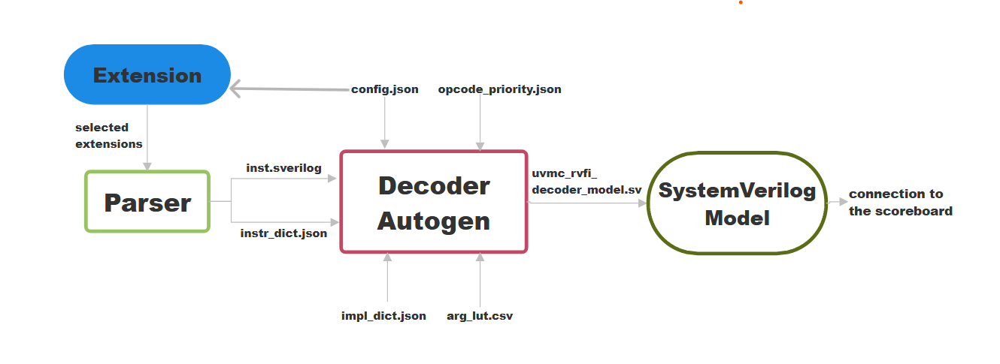

# `RISCV Model Autogen Documentation`

## Introduction

This document provides an in-depth explanation of how the **RISC-V UVM Reference Model** is automatically generated and integrated within the **CV32E20** verification environment.  


The autogen flow constructs a complete **SystemVerilog model** that emulates the instruction-level behavior of the RISC-V core.  
This includes parsing opcode definitions, extracting instruction fields, mapping their semantics, and generating an executable **UVM-compatible decoder model**.  
The result is a fully automated and reproducible process that can support both **standard** and **custom CORE-V extensions**.

---

# Internal Operation

## 1. Opcode Parsing

The **opcode parsing phase** prepares the low-level data used by the autogeneration step.  
It is handled by the script `../riscv-opcodes/parse.py`.  

This script reads the official RISC-V opcode definitions and converts them into two artifacts used later during model construction:

1. **`inst.sverilog`** — A SystemVerilog file containing all instruction encodings represented as `localparam [31:0]` values. These act as constants for each supported instruction.  
2. **`instr_dict.json`** — A JSON database describing, for each instruction, its variable fields.  

###  Usage

```bash
python3 parse.py [-sverilog] [extensions ...]
```
- **-sverilog** — Generate SystemVerilog file including selected extensions (inst.sverilog)

- **extensions** — A glob or list of globs selecting which RISC-V extension files to include


The supported extensions include both **standard** and **unratified/custom** CORE-V extensions, as summarized below:

| Extension | Description | Type | Notes |
|:-----------|:-------------|:------|:------|
| `rv_i` | Base integer instruction set | Standard | Core RISC-V integer operations |
| `rv_c` | Compressed instructions | Standard | 16-bit instruction encodings |
| `rv_m` | Integer multiplication and division | Standard | Adds `mul`, `div`, and `rem` |
| `rv32_c` | Compressed subset for RV32 | Standard | 32-bit variant of compressed ISA |
| `rv32_i` | Base integer ISA for 32-bit cores | Standard | Common base for all RV32 cores |
| `rv_zicsr` | Control and Status Registers | Standard | Enables CSR read/write access |
| `rv_system` | System-level instructions | Standard | Includes `mret`, `wfi`, etc. |
|||||
| `unratified/rv_addsub` | Add/Sub custom extension | Unratified | Basic custom arithmetic ops |
| `unratified/rv_addsubls3` | Add/Sub with LS3 field | Unratified | Adds LS3-based operand encoding |
| `unratified/rv_clip` | Clipping operations | Unratified | Signed/unsigned saturation |
| `unratified/rv_cmpsimd` | SIMD compare operations | Unratified | Adds `cv.cmp*` family |
| `unratified/rv_dotpsimd` | SIMD dot-product operations | Unratified | Adds `cv.dot*` instructions |
| `unratified/rv_gen_alu` | Generic ALU custom extension | Unratified | Flexible arithmetic ops |
| `unratified/rv_gensimd` | Generic SIMD extension | Unratified | Base support for SIMD |
| `unratified/rv_mac32` | 32-bit multiply-accumulate | Unratified | Adds `cv.mac*` instructions |
| `unratified/rv_mac168` | 16×8-bit MAC | Unratified | Mixed-width multiply-accumulate |
| `unratified/rv_mul168` | 16×8-bit multiply | Unratified | Mixed-width multiplication ops |
| `unratified/rv_postinc_load_store` | Post-increment load/store | Unratified | Adds memory ops with auto-increment |

---

## 3. Autogen Process 

The **autogen process** is the heart of the model generation flow.  
It converts instruction definitions and behavioral semantics into a ready-to-run SystemVerilog model.  
This is handled entirely by the script `../autogen/main.py`.

### Overview

`main.py` orchestrates all stages required to build the model — reading configurations, parsing instruction data, constructing the decoder, and injecting UVM logic.  
Its output is a single SystemVerilog file implementing the decoder model class, fully synchronized with the testbench.

### Step 1 — Configuration and Input Parsing

At startup, the script loads all necessary configuration and reference files:

#### Input files for the autogen script:

| File | Generated by |
|:------|:--------------|
| `inst.sverilog` | `parse.py` |
| `instr_dict.json` | `parse.py` |
| `instr_impl.json` | Manual |
| `../../riscv-opcodes/arg_lut.csv` | Predefined |
| `opcode_priority.json` | Manual |
| `model_config.json` | Manual |

- **`model_config.json`** — defines the name of the generated class (default `uvmc_rvfi_decoder_model`), base class, and selected ISA extensions.  
- **`instr_impl.json`** — provides behavioral implementations of each instruction in SystemVerilog syntax.  
- **`opcode_priority.json`** — defines priority rules to order similar or overlapping opcodes.  
- **`inst.sverilog` / `instr_dict.json`** — contain opcode encodings and field metadata automatically generated by `parse.py`.  
- **`arg_lut.csv`** — defines bit-slices for instruction operands (`rd`, `rs1`, `rs2`, `imm12`, etc.).

This combination allows `main.py` to reconstruct the entire ISA configuration and prepare a complete mapping of instruction formats and implementations.

### Step 2 — Database Construction

After loading all inputs, the script merges them into an **ISA database**, combining encoding, field, and semantic information from multiple sources.  
At this stage, the autogen engine reconstructs a full, in-memory representation of the instruction set, which will be used to generate the decoder logic.

Each instruction entry contains:
- its **decode pattern** (used as the `casez` condition),
- the **variable fields** to be extracted (e.g., `rd`, `rs1`, `rs2`, immediates),
- the **SystemVerilog implementation body** describing its behavior,
- and the **bit positions** for each field, defined in `arg_lut.csv`.

Internally, `main.py` maintains several Python dictionaries that organize and merge this data:

| **Dictionary** | **Source** | **Key / Value example** | **Purpose** |
|:----------------|:------------|:--------------------------|:-------------|
| `only_variable_fields` | `instr_dict.json` → `variable_fields` | `"ADD" : ["rd", "rs1", "rs2"]` | List of operand fields to extract for each instruction. |
| `implementations_dict` | `instr_impl.json` | `"addi" : "reg_file[rd] = reg_file[rs1] + imm12;"` | Maps instruction names to their SystemVerilog implementation body. |
| `arg_lut` | `arg_lut.csv` | `"rd" : (11,7)` → emits `rd = instr[11:7];` | Global lookup from operand name → bit-slice position in instruction word. |
| `opcode_dict` | `inst.sverilog` | `"ADD" : "32'b0000000??????????000?????0110011"` | Opcode name → binary match pattern used in `casez (instr)`. |
| `casez_dict` / `new_casez_dict` | Built dynamically by `main.py` | `"assign42" : "rd=instr[11:7]; rs1=...; reg_file[rd]=reg_file[rs1]+reg_file[rs2];"` | Temporary and reordered storage for all decoder branches before rendering. |
| `priority_list` | `opcode_priority.json` | `["C.ADDI", "C.ADD", "ADD", "SUB"]` | Explicit order for opcodes when decoding overlapping patterns. |
| `values` | `model_config.json` | `"class_name" : "uvmc_rvfi_decoder_model"` | Global model parameters (class name, base class, instruction width, etc.). |

All these dictionaries are validated to ensure consistency between field definitions, opcode patterns, and semantic bodies.  
Finally, `main.py` merges them to build a unified structure representing the full ISA,  
sorted according to `opcode_priority.json` so that **specific opcodes are matched before generic ones**.

This internal database forms the backbone for the next phase — generating the **decoder logic** and assembling the final SystemVerilog class.


### Step 3 — Decoder and Template Generation

The core of the generator is the creation of the **`decode_opcode()`** function.  
For each instruction, the tool generates:
1. Bitfield extraction lines (e.g., `rd = instr[11:7];`).  
2. The corresponding semantic block (from `instr_impl.json`).  
3. RVFI or CV-X-IF transaction preparation if required.

These elements are assembled into a large `casez (instr)` structure with one branch per instruction, plus a default branch for UNKNOWN instructions

After the `casez` logic is generated, `main.py` uses an internal **SystemVerilog template** containing placeholders for:
- field declarations,  
- architectural state (registers, CSRs, PC, memory),  
- `step()` function body,  
- and optional CV-X-IF plumbing.  

The placeholders are filled through formatted string substitution, producing a complete and properly formatted class definition.

### Step 4 — CV-X-IF Integration (optional)

CV-X-IF support can be enabled through -cop and -dmv ( you must use both of them ) flags, the generator includes additional logic to support **coprocessor transactions**.  


**`If you run our flow script run_vcs.py`** with the `-cop` and `-dmv` flags enabled, the script automatically performs the following actions:

- **Repository checkout:**  
  It clones or updates the hardware repositories for the **coprocessor** and **data mover** inside the `core-v-cores` directory.  
  The structure is expected as:
```
core-v-verif/core-v-cores 
                    |── coprocessor/
                    |── datamover/
                    └── cve2 core/
```


- For **standard simulations (no coprocessor)** → a stable commit of the `cve2 core` and `cve2 testbench ` is used.  
- For **CV-X-IF simulations (`-cop -dmv`)** → a specific branch commit known to include the CV-X-IF wrapper (`uvmt_cv32e20_dut_wrap.sv`), extended environments, and coprocessor features is selected automatically.  
This guarantees that both flows (with and without coprocessor) remain reproducible and use the correct set of RTL and UVM sources.


### Step 5 — File Emission

Finally, the completed model is written to:

```
core-v-verif/lib/uvm_components/uvmc_rvfi_reference_model/

```

Here is a flow chart of the autogeneration process:


---


## 4. Generated Model: `uvmc_rvfi_decoder_model`

The generated class is a fully functional SystemVerilog UVM model that sends RVFI ( and if needed CVXIF ) transactions that the scoreboard compares against RTL results.

### 4.1 Class Definition

The class name can be customized in `model_config.json`.  
This model overrides the base OpenHW class and provides concrete implementations of architectural behavior.

### 4.2 Internal State and Data Structures

The model maintains all essential processor state elements:

- **Memory** — an internal byte-addressable array ( .hex file ) holding the program memory image, loaded at build time using `$readmemh`.  
- **Program Counter (PC)** — tracks the address of the next instruction to execute.  
- **General Purpose Registers (GPRs)** — modeled as `bit [31:0] reg_file[31:0]`.  
- **Control and Status Registers (CSRs)** — modeled as `bit [31:0] csr_reg_file[4095:0]`, with initialization of key architectural registers (`mstatus`, `mepc`, `mcause`, `mtvec`, etc.).  
- **Temporary Signals** — variable fields (`rd`, `rs1`, `rs2`, `imm12`, `funct3`, `funct7`, LS2, LS3, etc.) declared based on `arg_lut.csv`.  


### 4.3 Runtime Execution in the UVM Environment

Unlike a standalone simulator, this model is **driven by the OpenHW UVM testbench**.  
The model does not run independently; it is wrapped and managed by the OpenHW environment **`core-v-verif`**, which controls when instructions are fetched and executed.

#### 4.3.1 Who calls the model
During simulation, the OpenHW testbench instantiates the autogenerated model and **calls its `step()` method** whenever the RTL core retires an instruction.  
This ensures perfect synchronization between DUT and reference model for RVFI comparison.
 
Your generated model **overrides** this method, defining exactly what happens at each architectural step.

#### 4.3.2 What happens inside `step()`
1. **Fetch** — The instruction word is read from memory at the current `pc`.  
2. **Decode and Execute** — The `decode_opcode()` function is called. It uses the autogenerated `casez (instr)` to:  
   - identify the instruction,  
   - extract its operand fields,  
   - execute its semantic implementation (register and memory updates, ALU, branch control, CSR writes).  
3. **Coprocessor (CV-X-IF) interaction** — If the instruction targets a CV-X-IF operation, the model prepares and issues the request transaction, then processes the response when it returns.  
   This mechanism is transparent to the testbench and it is integrated inside `decode_opcode()`.  
4. **RVFI Transaction** — After each instruction, an RVFI ( and CVXIF for custom instructions ) item is created and filled with results (e.g., instruction word, source and destination values, next PC).  
   This transaction is sent to the scoreboard using the UVM analysis port for real-time comparison with DUT signals.  
5. **Advance PC** — The PC is incremented or updated according to the instruction.


### 4.4 Interrupts and Trap Handling

The model implements a minimal interrupt controller and trap logic.  
It monitors pending interrupt flags (`mie`, `mip`) and updates the CSR state when an event is triggered.  
On a trap:
- `mepc`, `mcause`, `mtval`, and `mstatus` are updated.  
- The `pc` jumps to the vector at `mtvec`.  
Once serviced, the model resumes normal execution from `mepc`.

---

### 4.5 Summary

During simulation, the model behaves as a cycle-accurate architectural mirror of the DUT:
- The OpenHW UVM testbench calls `step()` in sync with the DUT retire signal.  
- Each call fetches, decodes, and executes exactly one instruction.  
- RVFI and CV-X-IF transactions are emitted for comparison and analysis.  
- Internal states and signals are fully visible in waveform viewers for debugging and validation.

---

## 5. Integration in the UVM Environment

The generated model is automatically integrated into the CORE-V-VERIF UVM environment during simulation setup.  

It connects to the UVM testbench as a **reference model** and can operate in different configurations depending on the selected test class:  
- As the **only** reference (model-only test)  
- Alongside **Spike** (dual-reference mode)  
- In combination with **CV-X-IF** coprocessor (cvxif mode)


---

## 6. Key Properties and Design Goals

| Property | Description |
|-----------|--------------|
| **Automatic Generation** | No manual intervention is required; the model is rebuilt every run. |
| **Extensible ISA** | Handles both standard and unratified CORE-V extensions. |
| **Interrupt Awareness** | Implements basic trap management. |
| **Waveform Transparency** | All internal signals and registers are visible in the waveform viewer (e.g. Verdi). |
| **UVM Compliant** | Fully compatible with the OpenHW UVM verification environment. |

---

## 7. Developer Notes and Customization

To extend or modify the generated model, follow this procedure:

1. **Define the new instruction** — Add its opcode and format in the **`riscv-opcodes`** repository.  
2. **Implement its semantics** — Insert its SystemVerilog behavior in `instr_impl.json`.  
3. **Adjust decoding priority** — If opcode patterns overlap, update `opcode_priority.json`.  
4. **Enable the extension** — Add the new extension in the `parse.py` command line ( instructions above ).  
5. **Regenerate the model** — Run `main.py` to rebuild and integrate the updated model automatically.

This modular design allows the autogen system to evolve alongside new extensions or project requirements with minimal manual editing.

---

